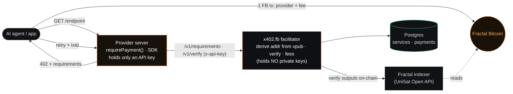
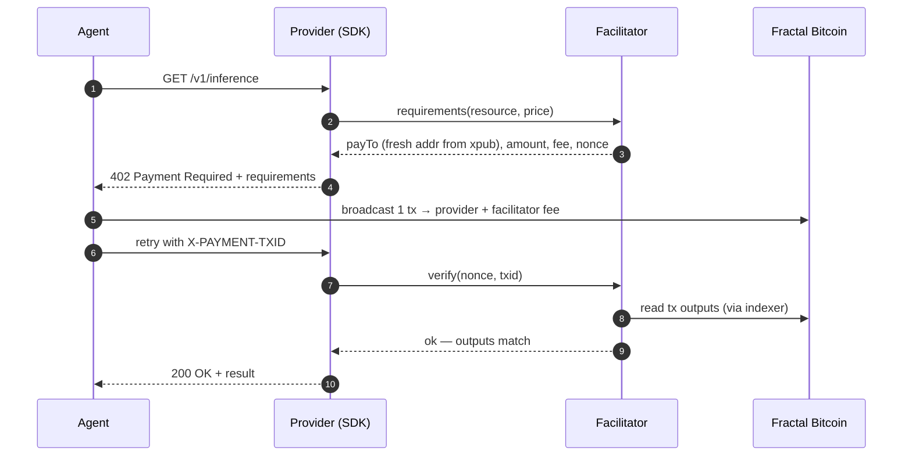

# x402.fb — the open payment rail for autonomous agents on Fractal Bitcoin


**A non-custodial, pay-per-call payment rail for Fractal Bitcoin (FB).** Any API, AI endpoint, data
feed, or agent service can charge **FB per request** over plain HTTP, using the
[x402](https://github.com/coinbase/x402) `402 Payment Required` standard. AI agents can't fill in a
signup form or a credit card — but they can pay a 10,000-sat invoice. This is the turnstile that lets
software buy capabilities by itself.

> 📖 **New here? Read [`VISION.md`](VISION.md)** (what & why) and [`SPEC.md`](SPEC.md) (the `fb-exact`
> wire format). Open core: **MIT protocol + SDKs + self-hostable facilitator** — free forever. See
> [`LICENSING.md`](LICENSING.md) for what's open vs the hosted service.

> **Status: proven end-to-end on Fractal mainnet.** The full flow (wallet sign-in → service → agent pays
> a real FB call → verified on-chain → served → fee accounted) settled real transactions
> (e.g. tx `bf8f37655ee8c3ee144440271ba7c4fdad058da5767d73617f7f6aac2eaeded5`).

## Why it's different
- **Non-custodial, earn-per-call.** Every paid request settles in **one FB transaction with two
  outputs** — the merchant's address **+** a small facilitator fee. The operator never holds funds (no
  money-transmitter exposure) yet earns on every call. (AI "relay" sites use prepaid custody — we don't.)
- **Multi-tenant SaaS.** Merchants sign up, register a service with their **own xpub**, and get an API
  key. The facilitator derives per-request receive addresses from their xpub (watch-only) and verifies
  payments via the UniSat Open API. No node to run.
- **Drop-in for providers, native for agents.** Service providers add one middleware; AI agents/clients
  auto-pay a `402` and retry. General rail — AI is just one use case.

## Architecture



**The 402 handshake** — one ordered exchange, non-custodial throughout:



| Module | Role |
|---|---|
| `src/core/*` | FB wallet (FB=BTC params), UniSat client (cardinal-UTXO-safe), `fb-exact` scheme + 2-output tx builder |
| `src/facilitator/*` | Postgres-backed multi-tenant service: auth, services, requirement issuance, verification, fee accounting |
| `src/sdk/middleware.ts` | provider drop-in — `requirePayment({ facilitatorUrl, apiKey, price })` |
| `src/sdk/agent.ts` | consumer/agent — `payAndFetch(url)` auto-pays a 402 |
| `src/examples/demo-server.ts` | example provider API (paywalled data + metered AI) |
| `src/e2e/full.ts` | full mainnet SaaS test |

## API (facilitator)
**Dashboard / management (JWT):**
`POST /v1/auth/register` · `POST /v1/auth/login` · `POST /v1/services {name,xpub,feeBps}` ·
`GET /v1/services` · `GET /v1/services/:id/payments` · `GET /v1/stats`
**Provider integration (header `x-api-key`):**
`POST /v1/requirements {resource,price}` → payment requirements · `POST /v1/verify {nonce,txid}` → status

## Integrate as a provider (the SDK)
```bash
npm install os-x402
```
```ts
import { requirePayment } from "os-x402/sdk";

app.get("/v1/inference",
  requirePayment({ facilitatorUrl: "https://x402.fb", apiKey: process.env.SVC_KEY!, price: 10_000 }),
  (req, res) => res.json({ out: model(req) }),   // only runs after payment is verified on-chain
);
```
That's the whole integration — no keys, no node, no DB on your side. (Publishing the SDK:
[`PUBLISHING.md`](PUBLISHING.md).)

## Run the full stack locally
```bash
cp .env.example .env          # UNISAT_API_KEY, FEE_ADDRESS, JWT_SECRET (+ PAYER_WIF for paying demos)
npm install
docker run -d --name x402-pg -p 127.0.0.1:5434:5432 \
  -e POSTGRES_USER=x402 -e POSTGRES_PASSWORD=x402 -e POSTGRES_DB=x402 postgres:16
npm run dev-stack             # facilitator :4040 + demo "Fractal Tools API" :4055
```

## See the value (autonomous agent pays for what it needs)
```bash
# an agent answers a question by BUYING on-chain data via x402, then reasoning with a model
# (free local Ollama by default; Claude if ANTHROPIC_API_KEY is set). Spends a little real FB.
npm run agent:demo "Is bc1q…  an active wallet, and does it hold any tokens?"
```

## Deploy the facilitator
```bash
# set UNISAT_API_KEY, FEE_ADDRESS, JWT_SECRET, POSTGRES_PASSWORD in the environment / .env
docker compose up -d          # postgres + facilitator + dashboard (facilitator holds NO private keys)
```
Put it behind HTTPS — the included `deploy/Caddyfile` does auto-HTTPS. Details in `deploy/DEPLOY.md`.

## Docs
- [`VISION.md`](VISION.md) — what we're building, roadmap, why it deserves a grant.
- [`SPEC.md`](SPEC.md) — the `fb-exact` x402 scheme (wire format + verification rules).
- [`LICENSING.md`](LICENSING.md) — the open-core boundary: what's free vs the hosted business.
- [`PUBLISHING.md`](PUBLISHING.md) — releasing the repo, npm SDK, and Python SDK.
- [`USAGE.md`](USAGE.md) — operator / provider / consumer cookbook.

## License
MIT — the protocol belongs to the ecosystem; the marketplace is the business ([`LICENSING.md`](LICENSING.md)).
Built by [The Lonely Bit](https://thelonelybit.org). Keep upstream BTCPay/third-party notices intact.
